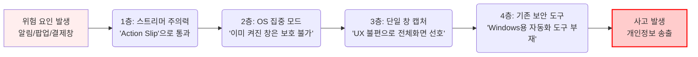
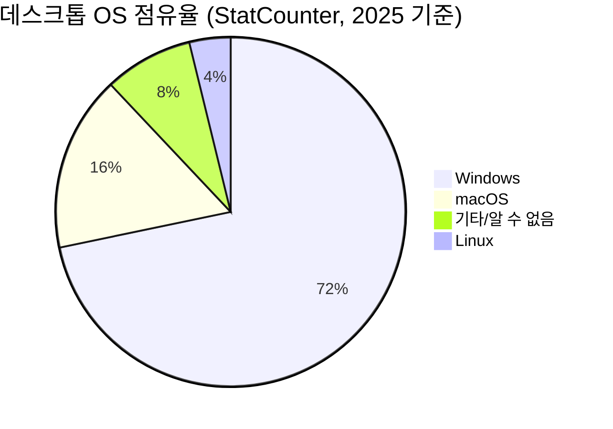
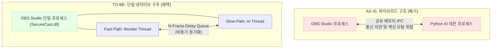
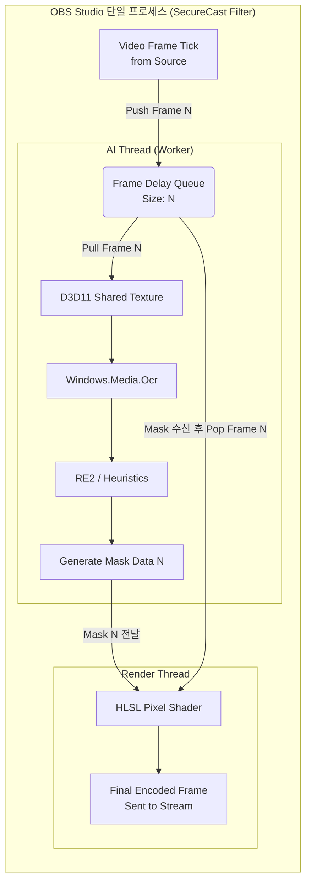
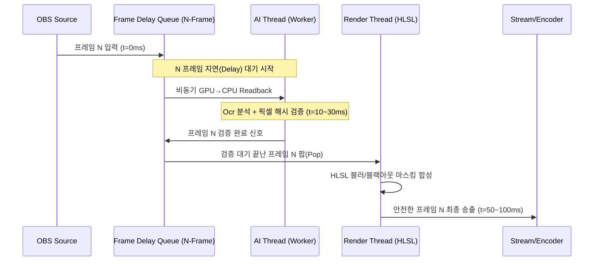
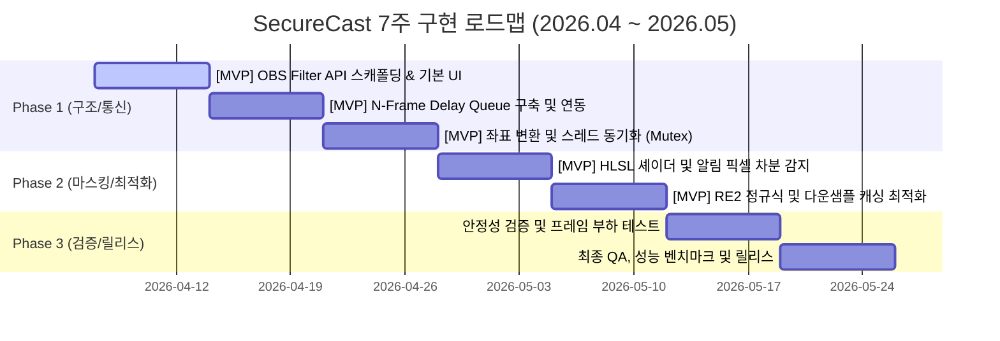

# 🛡️ [공학 프로젝트 중간 보고서] SecureCast: 스트리머 방송 중 개인정보 자동 차단 시스템

**팀명:** SecureCast 개발팀  
**주제:** OBS 플러그인 기반 실시간 선택적 화면 마스킹 시스템  
**보고서 버전:** v5.7 (Final Review & Refinement)  
**일자:** 2026-04-07  

---

## 1. 서론

### 1.1 프로젝트 개요

**SecureCast**는 Windows 환경에서 OBS Studio를 통해 라이브 방송 중 의도치 않게 노출되는 개인정보(메신저 알림, 주소, 계좌번호, DM 등)를 **자동으로 탐지하고 실시간으로 차단**하는 OBS 전용 플러그인입니다.

기존의 화면 공유 보안 솔루션들이 가진 근본적 한계—브라우저 내부만 보호하거나, macOS 전용이거나, 수동 조작을 요구하는 문제—를 극복하기 위해, **Windows OS 레벨의 네이티브 API**와 **온디바이스 AI 텍스트 분석 기술**을 결합한 **완전 로컬(On-device) 처리 방식**의 프라이버시 인프라를 구축합니다.

본 프로젝트는 대학생 4명으로 구성된 팀이 7주간의 개발 기간 동안 수행하며, OBS Studio의 공식 Filter API 위에서 동작하는 단일 C++ 네이티브 플러그인(DLL)으로 배포됩니다.

### 1.2 프로젝트 목표

본 프로젝트의 핵심 목표는 다음과 같습니다.

1. **노출 최소화(Minimized Exposure)**: 방송 중 민감 정보가 시청자에게 도달하기 전, OBS의 렌더링 파이프라인 내부에서 픽셀 단위로 차단한다. **N-Frame Render Delay 아키텍처**를 채택하여 송출 프레임을 3~5프레임(약 50~100ms) 버퍼링하고, AI가 해당 프레임을 먼저 검증한 뒤에야 인코더로 전달하므로, 돌발 상황 발생 시에도 미검증 프레임이 송출되지 않는 **Bounded Exposure(노출 상한 보장)** 구조를 실현한다.
2. **성능 영향 최소화(Near-Zero Impact)**: 스트리머의 게임 FPS 및 OBS 인코딩 성능에 지장을 주지 않도록, **정적 화면 시 CPU 점유율 2.0% 내외(타겟) / 분석 피크 시 5.0~8.0%(타겟)** 유지를 지향하며, GPU 셰이더 기반의 경량 렌더링을 통해 체감 성능 저하를 최소화한다.
3. **원클릭 배포(Portable Distribution)**: 별도의 인스톨러나 외부 프로그램 실행 없이, OBS 플러그인 폴더(모델 및 런타임 파일 포함) 복사만으로 즉시 동작하는 Portable 배포 구조를 확립한다.
4. **지능형 선택적 차단**: 화면 전체를 가리는 것이 아니라, AI 기반 분석을 통해 **민감 정보가 포함된 영역만 선택적으로 블러 처리**하여 시청 경험을 보존한다.

---

## 2. 문제 정의

### 2.1 화면 공유 시 프라이버시 사고의 현황

코로나19 이후 원격 협업 및 1인 미디어 스트리밍 시장의 폭발적 성장으로 인해 '화면 공유'는 필수 기능이 되었습니다. 그러나 전체 화면 공유 시 의도치 않게 노출되는 개인정보(메시지 팝업, 계좌번호, 주소 등)로 인한 프라이버시 침해 사례가 급증하고 있습니다.

특히 스트리머와 BJ는 하루 4~10시간 이상 화면을 실시간으로 수천~수만 명의 시청자에게 송출하며, 이 과정에서 한 번의 부주의가 신상 유출, 스와팅(허위 경찰 신고), 스토킹 등 심각한 물리적 위협으로 이어지는 사례가 반복되고 있습니다.

### 2.2 실제 사고 사례

#### 2.2.1 스트리머 및 BJ

| 스트리머 | 시기 | 노출 내용 | 결과 | 출처 |
|---|---|---|---|---|
| **Cheesur** | 2024 | 배달 봉투에 적힌 자택 주소 | xQc·Adin Ross가 방송에서 목격 → **즉시 스와팅** | [Sportskeeda, 2024](https://www.sportskeeda.com/esports/news-bag-food-full-address-it-xqc-adin-ross-react-kick-streamer-cheesur-getting-swatted-leaked-address) |
| **Jynxzi** | 2025.04 | Twitch 분석 페이지에서 월 수입 $452,448 노출 | 클립 바이럴 확산, 수입 논란 | [Dexerto, 2025](https://www.dexerto.com/entertainment/jynxzi-accidentally-leaks-monthly-twitch-income-on-stream-3220041/) |
| **Mizkif** | 2025.04 | 화면 공유 중 Twitter DM 노출 | 사적 대화 전체 공개 | [Sportskeeda, 2025](https://www.sportskeeda.com/us/streamers) |
| **우주하마** | 2020.12 | 스팀(Steam) 결제 중 개인정보(본명, 주소, 전화번호) 화면 노출 | 방송 중 구독자가 실제로 전화 발신, 당황하여 방송 긴급 종료 및 삭제 | [싱글리스트, 2020](https://www.slist.kr/news/articleView.html?idxno=206824) |
| **유후** | 2023.12 | 배달앱 주문 중 거주 지역 추정 가능 정보 노출 | **6개월간 스토킹 피해**, 이사 결정 | [서울경제, 2023](https://www.sedaily.com/NewsView/29YE64490M) |
| **Pokimane** | 2020.09 | Alt-Tab 중 개인 이메일(본명 포함) 노출 | 본명 바이럴 확산, 팬 커뮤니티 논란 | [Dexerto, 2020](https://www.dexerto.com/entertainment/pokimane-accidentally-leaks-her-real-name-on-twitch-stream-1422709/) |
| **IShowSpeed** | 2022.08 | 주소 정보 유출 | **생방송 중 경찰 출동·체포(스와팅)** | [Dexerto, 2022](https://www.dexerto.com/entertainment/ishowspeed-swatted-live-on-stream-1906498/) |
| **단팽이** | 2023 | 야외 방송 중 편의점 위치 노출 | 시청자 현장 추적, **스토킹** | 커뮤니티 기록 |

#### 2.2.2 교육자

| 사례 | 시기 | 노출 내용 | 결과 | 출처 |
|---|---|---|---|---|
| **Zhang 교수** | 2020 | Zoom 수업 중 브라우저 북마크 바 노출 | 사직/해고, TikTok 80만 뷰 바이럴 | 언론 보도 종합 |
| **한국외대 A 교수** | 2020.03 | 온라인 강의 화면 녹화 중 카카오톡 대화창(부적절한 영상) 노출 | 진상 조사 및 징계 검토, 언론 보도 등 사회적 물의 | [연합뉴스, 2020](https://www.yna.co.kr/view/AKR20200325189900004) |

#### 2.2.3 직장인

원격 근무 환경에서의 화면 공유 사고는 개인의 민망함을 넘어 기업 기밀 유출로 확대될 수 있습니다. Alashwali et al. [1] 연구팀 조사에 따르면, 214명의 재택 근무자 설문 데이터를 분석한 결과 화상 회의 중 프라이버시 침해가 빈번하게 발생하고 있음이 확인되었습니다. 응답자의 상당수가 화면 공유 중 이메일, 파일, 개인화된 웹 브라우징 데이터(탭, 광고, 방문 기록)가 의도치 않게 표시된 경험이 있다고 답했습니다.

#### 2.2.4 기타 전문직 (의료/법조/금융)

의료·법조·금융 분야에서는 화면 공유 시 환자 정보(HIPAA 위반), 소송 문서, 고객 계좌 정보 등의 노출이 법적 제재와 직접 연결됩니다. 원격 진료 및 화상 법정 심리가 확대되면서 이러한 리스크는 더욱 증가하고 있습니다.

### 2.3 통계 및 연구 기반 근거

#### 2.3.1 문제의 규모

| 지표 | 수치 | 출처 |
|---|---|---|
| 전체 데이터 침해 사고 중 인적 요소(Human Element) 관여 비중 | **68%** | [Verizon DBIR, 2024] [12] |
| 전체 데이터 침해 사고 중 단순 실수(Error)에 의한 사고 비중 | **28%** | [Verizon DBIR, 2024] [12] |

#### 2.3.2 문제의 악화 추세

| 지표 | 수치 | 출처 |
|---|---|---|
| 부주의한 내부자(Careless Insider) 사고로 인한 연간 평균 피해액 | **$8.8M** | [Proofpoint, 2025] [13] |
| 인적 오류(Human Error)를 조직의 최대 보안 취약점으로 인식하는 CISO 비율 | **74%** | [Proofpoint, 2025] [13] |

#### 2.3.3 보호 조치의 부재

Alashwali et al. [1] 연구에 따르면, 214명의 설문 데이터를 분석한 결과 수동적 보호 조치의 한계가 명확히 드러납니다. 원격 근무자들은 화면 공유 시 프라이버시를 보호하기 위해 주로 **수동적 방법**(특정 창만 공유, 프라이빗 브라우징, 히스토리 삭제 등)에 의존하고 있으며, 화상회의 도구의 내장 프라이버시 기능은 **충분히 활용되지 못하고** 있습니다.

### 2.4 행동심리학적 근거 — "조심하면 되는 거 아닌가?"에 대한 반박

"주의하면 사고를 막을 수 있다"는 주장은 인간의 인지적 한계를 무시한 것입니다. 특히 스트리머처럼 게임·채팅·도네이션·시간 관리를 동시에 수행하는 고부하 멀티태스킹 환경에서는 다음과 같은 심리학적 메커니즘에 의해 실수가 **구조적으로 불가피**합니다.

#### 2.4.1 Action Slip / Capture Error

Reason [2]의 인적 오류 분류 체계에 따르면, **Action Slip**은 올바른 의도를 가지고 있음에도 실행 단계에서 자동화된 루틴이 의도를 덮어쓰는 현상입니다. 스트리머가 방송 시작 → 게임 실행이라는 고도로 자동화된 루틴에 빠지면, "알림 끄기"라는 비루틴적 단계가 습관에 의해 건너뛰어질 확률이 높습니다.

#### 2.4.2 Inattentional Blindness / Cognitive Load

Mack & Rock [3]이 정의한 **무주의 맹시(Inattentional Blindness)**는 주의가 특정 작업에 집중되면 시야 내의 다른 자극을 물리적으로 인지하지 못하는 현상입니다. 스트리머는 게임 플레이와 시청자 채팅에 동시에 집중하므로, 화면 구석에 뜨는 알림 팝업을 실제로 **보지 못할** 확률이 매우 높습니다.

#### 2.4.3 Swiss Cheese Model

Reason [4]이 제안한 **스위스 치즈 모델**은 시스템의 방어 계층을 구멍 뚫린 치즈 조각에 비유합니다. 각 방어층(프로토콜, 자동화 경보, 물리적 장벽, 훈련된 인력)에는 고유한 약점("구멍")이 존재하며, 여러 층의 구멍이 우연히 정렬되면 사고가 발생합니다.

현재 스트리머의 4층 개인정보 보호 방어 체계가 어떻게 붕괴되는지 아래 다이어그램으로 시각화할 수 있습니다.

* **4층 (자동화 도구)** 영역이 현재 Windows 환경에서 완전히 비어 있으며, 바로 이 지점이 SecureCast가 메우고자 하는 핵심 방어선입니다.

---

## 3. 타겟 결정

### 3.1 타겟별 위험도 및 동기 비교

| 기준 | 일반인 | 기업인 | 스트리머 |
|---|---|---|---|
| **화면 공유 시간/일** | 0~0.5시간 | 0.5~1시간 | **4~10시간** |
| **동시 시청자 수** | 1~5명 | 5~20명 | **수백~수만 명** |
| **노출 시 즉시 캡처 확률** | 매우 낮음 | 낮음 | **극도로 높음** (녹화 기본) |
| **최악의 결과** | 민망함 | 해고·기밀유출 | **스와팅·스토킹·신체 위협** |
| **기존 보안 대안** | 조심하면 됨 | 기업 DLP 솔루션 | **사실상 전무** |
| **도구 채택 의지** | 약함 | 중간 (회사 규정) | **극도로 높음** (생존 직결) |
| **IT 친숙도** | ★☆☆☆ | ★★☆☆ | **★★★★** (OBS, Stream Deck 등 이미 사용) |

### 3.2 스트리머 선정의 3대 근거

**1. 신체적 위협 (Physical Safety)**: 주소 노출은 즉각적인 스와팅이나 스토킹의 표적이 됩니다.
**2. 경제적 타격 (Financial Impact)**: 한 번의 실수로 인한 플랫폼 영구 정지나 스폰서 해지 위험이 큽니다.
**3. 인지 부하 (Cognitive Load)**: 멀티태스킹 환경은 심리학적으로 'Action Slip'이 발생하기 가장 쉬운 조건입니다.

### 3.3 관련 학술 논문 근거

| 논문 | 저자 | 발표 | 핵심 내용 |
|---|---|---|---|
| "Tell Me Before You Stream Me" | Li et al. [5] | ACM CSCW, 2018 | 게임 라이브 스트리밍에서 타인에 의해 방송되는 플레이어의 정보 공개 관리 전략 연구 |
| "I Am Concerned, But..." | Wu et al. [6] | ACM CSCW, 2022 | 스트리머 본인의 정보 공개에 대한 프라이버시 우려와 전략 분석 |
| "Comparative Evaluation of Visual Obfuscation Methods" | Makita et al. [7] | ACM MobileHCI, 2025 | 화면 공유 시 프라이버시 보호를 위한 시각적 난독화 필터 비교 평가 — **배경색 마스킹** 선호됨 |

---

## 4. 기존 시장 분석

### 4.1 기존 솔루션 현황 및 한계

| 서비스명 | 플랫폼 | 주요 기능 | 치명적 한계 |
|---|---|---|---|
| **[StreamFX](https://github.com/Xaymar/obs-StreamFX)** | **OBS 플러그인** | 소스 단위의 정적(Static) 블러 필터 적용 | ① **고정된 영역이나 윈도우만 블러 처리 가능** (수동 지정 필요) ② 팝업, 스크롤 등 움직이는 개인정보 동적 추적 불가 ③ AI 감지 완전 부재 |
| **[Invisiwind](https://github.com/radiantly/Invisiwind)** | Windows | `SetWindowDisplayAffinity` 기반 창 캡처 제외 | ① 자동 감지 없음 ② DLL 인젝션 → **바이러스 오탐** ③ Win11 버그 |
| **[Muzzle](https://muzzleapp.com)** | **macOS 전용** | 화상회의 감지 → 알림 자동 차단 | ① **macOS 전용** → Windows 스트리머 사용 불가 |
| **[Stealthly](https://stealthly.app)** | **macOS 전용** | 화면 감지 → 자동 DND + 아이콘 숨김 | **macOS 전용** → Windows 대상 불가 |
| **[ContextBlur](https://contextblur.app)** | Chrome 확장 | 브라우저 내 요소 블러, PII 자동 감지 | **브라우저 내부만** 작동 → 데스크톱 앱 보호 **불가** |

### 4.2 OS 점유율과 Windows 솔루션의 공백

기존의 자동화된 화면 보안 솔루션(Muzzle, Stealthly 등)은 **모두 macOS 전용**입니다. 반면 스트리머들이 사용하는 OBS 플러그인(StreamFX 등)은 **자동 감지 지능이 전혀 없는 완전 수동 도구**에 불과합니다.

위 차트에서 보듯, 전체 데스크톱 사용자의 **약 72%를 차지하는 Windows 환경**에는 AI 기반의 자동화된 스트리머 프라이버시 보호 도구가 **사실상 존재하지 않습니다.** 이것이 SecureCast가 채워야 할 거대한 시장 공백입니다.

---

## 5. 제품 형태 결정

### 5.1 왜 독립 앱(.exe)이 아닌 OBS 플러그인인가

| 비교 항목 | 독립 앱 (.exe) | **OBS 플러그인 (채택)** |
|---|---|---|
| **보안 무결성** | 오버레이 방식 → 캡처 우회 가능성 존재 | **렌더링 파이프라인 내부** 처리 → 우회 불가 |
| **성능** | 별도 프로세스 → CPU/메모리 추가 소비 | **OBS 내부 스레드** → 오버헤드 최소 |
| **안티치트 충돌** | 게임 안티치트에 의해 외부 오버레이 차단 위험 | OBS 내부 동작 → **충돌 없음** |

### 5.2 왜 전부 차단이 아닌 선택적 차단인가

화면 전체를 검게 가리거나 숨기는 방식(Full Blackout)은 시청자의 몰입을 즉각적으로 방해합니다. 따라서 **맥락(Context)을 보존하는 선택적 차단**이 필수적입니다.

| 비교 항목 | 전부 차단 (Full Blackout / 화면 가림) | **선택적 차단 (SecureCast 채택)** |
|---|---|---|
| **시청 경험 (흐름 보존)** | 화면 전체가 갑자기 까매짐 → 시청자 당황 및 대량 이탈 발생 | **민감 영역만 블러 처리** → 게임 플레이나 바탕화면의 전반적인 맥락이 유지되어 시청 흐름이 끊기지 않음 |
| **스트리머 수익 보존** | 도네이션 팝업이나 게임 내 중요 UI까지 모두 가려짐 | 위험 정보만 가리고 도네이션 등 **수익 창출에 필요한 시각적 요소는 온전히 보존** |
| **학술적 근거 (Makita et al. [7])** | 과도한 난독화는 '가림(Hiding)' 효과는 크나 시청자의 불편함을 초래한다고 지적함 | **"Context-preserving obfuscation"**(맥락 보존 난독화, 예: 배경색 마스킹/블러)이 보호력과 시청자 수용성 간의 최적의 균형점임을 실험적으로 증명함 |

### 5.3 기술 아키텍처 전환 (v4.x → v5.7)

프로젝트 초기에는 구현 난이도를 낮추기 위해 C++ 플러그인과 Python AI 데몬을 연결하는 하이브리드 구조(v4.x)를 검토했으나, 보안/성능 리뷰 결과 치명적 결함(오버헤드, 백신 오탐 위험)이 발견되어 **단일 C++ 네이티브 구조(v5.7)**로 전면 개편했습니다.

---

## 6. 핵심 기능 정의 (Scope Management)

**[프로젝트 범위 관리 노트]** 7주라는 제한된 개발 기간과 대학생 4명이 참여하는 리소스를 고려하여, 기능의 우선순위를 **[MVP (핵심 필수 구현)]**과 **[후순위/V2 (여력 시 확장 구현)]**으로 명확히 구분하여 개발 리스크를 관리합니다.

### 6.1 [MVP] 블랙리스트 앱 자동 차단
- **기능**: 카카오톡, 디스코드 등 사전 등록된 민감 앱이 활성화되면 화면 렌더링을 차단합니다. 6.1 블랙리스트에 등록된 앱은 창 전체가 차단되므로 6.2 분석 대상에서 제외됩니다.
- **기술**: `EnumWindows`로 활성 창을 열거한 뒤, `DwmGetWindowAttribute(DWMWA_EXTENDED_FRAME_BOUNDS)`를 호출하여 그림자(Drop Shadow)를 제외한 순수 클라이언트 영역의 절대 좌표만 정확히 추출하고, HLSL 셰이더에서 해당 픽셀을 Discard 처리합니다.

### 6.2 [MVP] 위험 키워드 영역 지능형 블러
- **기능**: 6.1에서 걸러지지 않은 일반 앱이나 웹 브라우저 내 화면에 주소, 연락처, 계좌번호 등이 등장하면 해당 텍스트 영역만 블러 처리합니다.
- **기술**: Windows 내장 하드웨어 가속 OCR(`Windows.Media.Ocr`)로 텍스트를 추출하고, RE2 정규표현식 및 휴리스틱 필터로 민감도를 초고속 판별합니다. 한국어 OCR 정확도는 Phase 3에서 실측 검증하며, 인식률이 목표 미달 시 Tesseract 5 한국어 학습 모델(kor.traineddata)로 대체합니다.

### 6.3 [MVP] 선택적 앱 알림 차단
- **기능**: 카카오톡 등 특정 앱의 알림 팝업만 골라서 억제합니다.
- **기술**: Render Thread의 Compute Shader에서 알림 영역(우측 하단 고정 좌표)의 프레임 간 픽셀 차분(Frame Diff)을 계산하고, 변화량이 임계값을 초과하면 해당 영역을 블러 마스크에 즉시 추가합니다. 병행하여 사용자에게 Windows 집중 모드(Focus Assist) 설정을 안내합니다.

### 6.4 [후순위] 수동 드래그 블러
- 사용자 지정 영역을 즉석에서 블러 처리하는 기능. (OBS 기본 기능이나 타 플러그인과 겹치므로 후순위 배정)

### 6.5 [후순위] 패닉 버튼
- 긴급 상황 시 핫키 하나로 전체 화면 블러를 즉시 가동하는 최후의 비상 기능.

### 6.6 [후순위] 위험 경고 UI
- 민감 정보 탐지 시 스트리머 본인 화면에만 붉은 경고등을 띄워 인지시킵니다.

### 6.7 [후순위] 게임 모드 (Game Mode)
- **기능**: 전체 화면 게임 감지 시 무거운 AI 분석(Slow-Path)을 자동 일시정지(Partial Sleep)합니다.
- **효과**: 게임 중 AI 분석 부하를 완전히 제거하며, 이벤트 감시 루프의 오버헤드는 무시 가능 수준(< 0.1%)으로 유지합니다. 게임 모드 중에도 Render Thread 내 경량 이벤트 루프가 포그라운드 윈도우 전환(`EVENT_SYSTEM_FOREGROUND`) 및 알림 영역 변화를 감시하며, 위험 감지 시 AI Thread를 즉시 Wake-up하여 보호 모드로 복귀합니다.

---

## 7. 제어 범위

### 7.1 민감 정보 유형 및 사고 사례 매핑

| 정보 유형 | 실제 사고 사례 | 결과 |
|---|---|---|
| **자택 주소** | Cheesur / 우주하마 (스팀 결제창) | 즉시 스와팅, 방송 긴급 종료 |
| **실명/전화번호** | 우주하마 (결제창 중 번호 노출) | 시청자가 실제로 전화 발신 |
| **수입/금융** | Jynxzi (Twitch 분석 페이지) | 수입 논란 및 바이럴 확산 |
| **사적 대화** | Mizkif(DM) / 한국외대 교수(카톡) | 사생활 공개, 징계 검토 물의 |

### 7.2 보호 대상 핵심 앱 목록

1. **카카오톡/디스코드**: 대화 내용, 실명, 서버 내역 등 (한국 점유율 압도적)
2. **스팀 및 웹 브라우저 결제창**: 결제 진행 중 본명, 주소, 카드번호 노출 위험
3. **배달앱(PC 웹) 및 메모장**: 주소, 이전 작업 내역 자동 복원 등

---

## 8. 기술 아키텍처

### 8.1 전체 시스템 구조 (N-Frame Render Delay 아키텍처)

SecureCast v5.7은 "노출 제로"를 달성하기 위해, 기존의 비동기 후행 분석 방식을 버리고 **N-Frame Render Delay (렌더링 지연 큐)** 구조를 채택했습니다. 

### 8.2 프레임 단위 동작 흐름 (Bounded Exposure 전략)

송출 프레임을 3~5프레임(약 50~100ms) 동안 버퍼링합니다. AI가 해당 프레임을 **먼저 검증한 뒤에야** 인코더(송출)로 전달하므로, 돌발 상황 발생 시에도 미검증 프레임이 송출되지 않는 Bounded Exposure 구조를 실현합니다.

### 8.3 최적화 전략: GPU→CPU 전송 및 BBox 캐싱

AI 분석을 위해 매번 1920x1080 전체 화면을 GPU에서 CPU로 복사하면 PCIe 대역폭 병목이 발생합니다. v5.7에서는 **64x64 다운샘플 해싱(Downsampled Pixel Hash)** 기법을 적용하여 연산량과 전송량을 극적으로 줄였습니다.

**[표 8-1] GPU→CPU 메모리 전송 전략 비교**

| 전송 전략 | 1프레임당 전송량 (1080p 기준) | 정확도 (Hash Collision 위험) | CPU 부하 | **결론** |
|---|---|---|---|---|
| 전체 프레임 복사 | ~8.2 MB | 100% | 극심함 | ❌ 기각 (병목 유발) |
| ROI 원본 크롭 복사 | ~0.5 MB ~ 2.0 MB | 100% | 높음 | ❌ 기각 (ROI 수에 비례해 GPU→CPU Readback 호출 증가, 부하 예측 불가) |
| 단순 16x16 해싱 | 약 1 KB | 낮음 (끝자리 변경 감지 불가) | 극저 | ❌ 기각 (보안 결함) |
| **64x64 다운샘플 해싱** | **~16 KB (고정)** | **높음 (구조적 유사도 보존, 미세 변화 미감지 가능성 극소화)** | **낮음** | **✅ v5.7 최종 채택** |

* GPU 셰이더 레벨에서 BBox 영역을 64x64로 1차 축소한 뒤 CPU로 넘겨 픽셀 해시(Pixel Hash)를 비교합니다. 이전 프레임과 일치하면 무거운 OCR 과정을 통째로 건너뜁니다.

---

## 9. 성능 목표

| KPI | 목표 수치 | 달성 방법 |
|---|---|---|
| **CPU 점유율 (정적 화면)** | **2.0% 내외** | 적응형 Dirty Rect Skip + 64x64 다운샘플 해싱 검증 |
| **CPU 점유율 (동적 화면)** | **5.0~8.0%** | 하드웨어 가속 OCR 활용 및 불필요한 영역 연산 배제 |
| **탐지 재현율 (Recall)** | **90% 이상** | Windows.Media.Ocr + RE2 한국어 특화 패턴 (민감 정보 미탐지율 10% 이하) |
| **오탐률 (False Positive)** | **15% 이하** | 휴리스틱 필터 및 BBox 문맥 2차 검증 |
| **방송 송출 지연 (Delay)** | **최대 100ms 이내** | N-Frame Delay Queue 버퍼링 사이즈 제어 (3~5프레임) |
| **노출 무결성** | **Bounded Exposure** | 팝업 출현 시에도 송출 지연 큐를 통해 시스템적 유출 방지 |

> ※ 상기 수치는 설계 목표(Design Target)이며, Phase 3 성능 벤치마크를 통해 실측값으로 교체 예정입니다. (게임 모드의 성능 오버헤드 < 0.1% 목표는 V2 기능으로 이관)

---

## 10. 경쟁사 비교 및 차별성

| 항목 | StreamFX (OBS 플러그인) | Invisiwind | Muzzle | ContextBlur | **SecureCast (본 프로젝트)** |
|---|---|---|---|---|---|
| **플랫폼** | Windows/macOS/Linux | Windows | macOS | Chrome 확장 | **Windows (OBS 플러그인)** |
| **OS 데스크톱 앱 보호** | 수동 선택만 | ✅ (수동) | ❌ | ❌ | **✅ (OS 전체 자동 분석)** |
| **AI PII 지능형 탐지** | ❌ (화면 내 이동 시 추적 불가) | ❌ | ❌ | ✅ (브라우저만) | **✅ (OS 전체)** |
| **성능 저하 우려** | 낮음 | DLL 인젝션 불안정 | 낮음 | 낮음 | **성능 영향 최소화 (Near-Zero)** |
| **노출 원천 차단** | ❌ (수동 조작 전까지 노출) | ❌ (수동 조작 전까지 노출) | ❌ (감지 후 차단) | ❌ (렌더 전 노출) | **✅ (N-Frame Delay 송출 대기)** |
| **게임 모드 지원** | ❌ | ❌ | ❌ | ❌ | **✅ (V2 예정)** |

**SecureCast의 핵심 차별점:**
1. **유일한 Windows + 자동 보호 + 스트리머 특화** 포지션
2. **렌더링 파이프라인 내부** 처리로 캡처 우회 구조적 불가
3. **N-Frame Render Delay 기술**: 어떤 돌발 상황(팝업, 탭 전환 등)에서도 AI가 안전을 확인할 때까지 송출을 쥐고 있는 **진정한 의미의 Bounded Exposure** 구현
4. **AI 기반 지능형 선택적 블러**로 시청 경험 보존
5. **선택적 앱 알림 차단**: OS 레지스트리 조작 없이 렌더링 파이프라인 내부에서 픽셀 변화를 감지해 알림을 차단하는 안정적 구조

---

## 11. 구현 일정 (7주 로드맵)

대학생 4명이 7주 내에 C++ 네이티브 AI 파이프라인과 D3D11 셰이더를 통합해야 하는 공격적인 일정을 고려하여, 핵심 마일스톤(Phase) 위주로 간트 차트(Gantt Chart)를 수립했습니다.

> **⚠️ 일정 리스크 대처 (Plan B)**: Phase 1의 N-Frame Delay Queue 구현에서 심각한 병목이 발견될 경우, 지연 기능을 비활성화하고 '선제적 BBox 15% 확장 임시 블러' 방식으로 우선 선회하여 [MVP] 수준의 릴리스 안정성을 최우선으로 확보합니다.

---

## 12. 현재 진행 상황

| 완료 항목 | 상태 | 비고 |
|---|---|---|
| 문제 정의 및 타겟 선정 | ✅ 완료 | 스트리머 특화 전략 확정 |
| 기존 하이브리드 아키텍처 폐기 | ✅ 완료 | 단일 프로세스 전환 |
| **아키텍처 (N-Frame Delay) 확정** | ✅ 완료 | Bounded Exposure 방어 논리 완성 |
| **최적화 기법 (다운샘플 해싱) 설계** | ✅ 완료 | CPU/GPU 자원 점유 최적화 계획 확립 |
| W1 로드맵 구현 착수 | 🔄 진행 중 | 현재 OBS Plugin 스캐폴딩 작업 중 |

---

## 13. 결론 및 향후 계획

### 위협 모델 범위 (Threat Model)
본 프로젝트는 비의도적 노출(Accidental Exposure) 방지에 초점을 둡니다. 스트리머 본인이 정상적으로 SecureCast를 활성화한 상태에서 발생하는 돌발 노출을 차단하는 것이 목표이며, 플러그인 강제 비활성화·셰이더 교체·OBS 로드 순서 조작 등 시스템을 장악한 공격자의 악의적 우회(Adversarial Bypass) 시나리오는 V2에서 서명 검증 및 무결성 체크를 통해 대응할 예정입니다.

### 결론

SecureCast는 "주의하면 막을 수 있다"는 인간의 인지적 한계를 극복하고, 구조적으로 프라이버시 유출을 차단하는 기술적 방어선(4층 방어막)입니다. 

Windows 생태계 내 유일무이한 완전 자동화 도구로서, **1) N-Frame Render Delay를 통한 결정적 노출 차단(Bounded Exposure)**, **2) 64x64 다운샘플 해싱을 통한 성능 최적화**, **3) Compute Shader를 활용한 지능형 알림 팝업 차단**을 통해 성능과 보안의 완벽한 균형을 제공합니다.

### 향후 계획 (V2 로드맵)
단기적으로 7주 내 핵심 MVP 기능을 안정화한 후, 장기적으로는 **후순위 기능들(게임 모드 자동 일시정지, 패닉 버튼, 위험 경고 UI)**을 보강하고 비정형 데이터 판별을 위한 ONNX Classifier 탑재, 시청 경험을 높이는 배경색 마스킹 옵션 도입 등을 추가하여 Microsoft Store 공식 배포를 목표로 합니다.

---

## 참고 문헌

| # | 분류 | 출처 |
|---|---|---|
| [1] | 원격 근무 프라이버시 | Alashwali, E. et al., "Work from home and privacy challenges: what do workers face and what are they doing about it?," *Journal of Cybersecurity*, vol. 11, no. 1, Oxford Academic, 2025. |
| [2] | 행동심리학 (Action Slip) | Reason, J., *Human Error*, Cambridge University Press, 1990. |
| [3] | 행동심리학 (Inattentional Blindness) | Mack, A. & Rock, I., *Inattentional Blindness*, MIT Press, 1998. |
| [4] | 행동심리학 (Swiss Cheese Model) | Reason, J., "The contribution of latent human failures to the breakdown of complex systems," *Philosophical Transactions of the Royal Society of London. Series B*, 327(1241), 1990. |
| [5] | 스트리머 프라이버시 | Li, Y. et al., "Tell Me Before You Stream Me," *Proc. ACM Hum.-Comput. Interact.* (CSCW), 2018. |
| [6] | 스트리머 프라이버시 | Wu, Y. et al., "'I Am Concerned, But...'," *Proc. ACM Hum.-Comput. Interact.* (CSCW), 2022. |
| [7] | 시각적 난독화 비교 | Makita, R. et al., "Comparative Evaluation of Visual Obfuscation Methods for Protecting Private Information in Screen Sharing," *ACM MobileHCI '25 Adjunct*, 2025. |
| [8] | 스트리머 사고 (Cheesur) | Sportskeeda, "Kick streamer Cheesur getting swatted after leaked address," 2024. |
| [9] | 스트리머 사고 (Jynxzi) | Dexerto, "Jynxzi accidentally leaks monthly Twitch income on stream," 2025. |
| [10] | 스트리머 사고 (유후) | 서울경제, "유후 스토킹 피해 고백," 2023. |
| [11] | 스트리머 사고 (Pokimane) | Dexerto, "Pokimane accidentally leaks her real name on Twitch stream," 2020. |
| [12] | 데이터 침해 통계 (DBIR) | Verizon, "2024 Data Breach Investigations Report (DBIR)". [보고서 링크](https://www.verizon.com/business/resources/reports/dbir/) |
| [13] | 내부자 위험 통계 | Proofpoint, "2025 Voice of the CISO / Cost of Insider Risks Global Report". [보고서 링크](https://www.proofpoint.com/us/resources/threat-reports/cost-of-insider-threats) |
| [14] | OS 점유율 통계 | StatCounter, "Desktop Operating System Market Share Worldwide," 2025. |
| [15] | 경쟁사 (StreamFX) | Xaymar/obs-StreamFX, GitHub Repository. |
| [16] | 핵심 API | Microsoft Learn, "SetWindowDisplayAffinity function." |